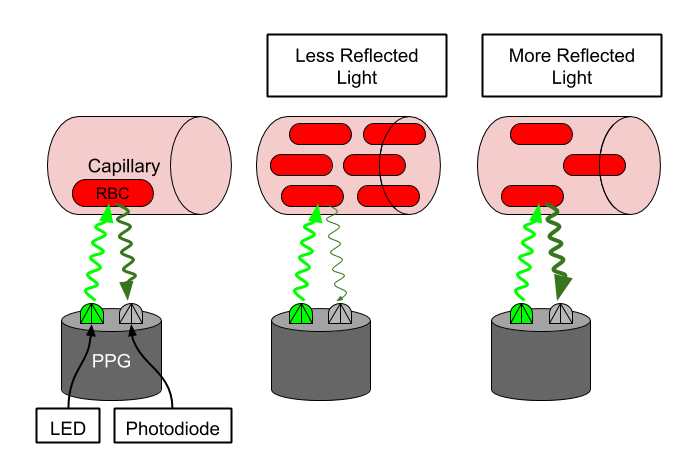

<div id="top"></div>

<!-- PROJECT LOGO -->
<br />
<div align="center">
  <h3 align="center">Pulse Rate Estimation using Wearable Data</h3>

</div>

<!-- TABLE OF CONTENTS -->
<details>
  <summary>Table of Contents</summary>
  <ol>
    <li>
      <a href="#about-the-project">About The Project</a>
      <ul>
        <li><a href="#premise">Premise</a></li>
        <li><a href="#data">Data</a></li>
        <li><a href="#execution-plan">Execution Plan</a></li>
        <li><a href="#challenges-and-improvements">Challenges and improvements</a></li>
      </ul>
    </li>
    <li>
      <a href="#getting-started">Getting Started</a>
      <ul>
        <li><a href="#setting-up-a-conda-environment">Setting up a conda environment</a></li>
        <li><a href="#usage">Usage</a></li>
        <li><a href="#file-descriptions">File descriptions</a></li>
      </ul>
    </li>
    <li><a href="#additional-notes">Additional Notes</a></li>
    <li><a href="#license">License</a></li>
    <li><a href="#contact">Contact</a></li>
    <li><a href="#acknowledgments">Acknowledgments</a></li>
  </ol>
</details>

---

## About The Project

In this mini-project, I developed an algorithm to estimate the pulse rate at 2-second intervals using PPG and Accelerometer signals from a wearable device. In a second part, I explored how the resting heart rate varies among different age groups between males and females.

### Premise

A core feature that many users expect from their wearable devices is pulse rate estimation. Continuous pulse rate estimation can be informative for many aspects of a wearer's health. Pulse rate during exercise can be a measure of workout intensity and resting heart rate is sometimes used as an overall measure of cardiovascular fitness.

### Physiological Mechanics of Pulse Rate Estimation

Pulse rate is typically estimated by using the PPG sensor. When the ventricles contract, the capilaries in the wrist fill with blood. The (typically green) light emitted by the PPG sensor is absorbed by red blood cells in these capilaries and the photodetector will see the drop in reflected light. When the blood returns to the heart, fewer red blood cells in the wrist absorb the light and the photodetector sees an increase in reflected light. The period of this oscillating waveform is the pulse rate.



However, the heart beating is not the only phenomenon that modulates the PPG signal. Blood in the wrist is fluid, and arm movement will cause the blood to move correspondingly. During exercise, like walking or running, we see another periodic signal in the PPG due to this arm motion. Our pulse rate estimator has to be careful not to confuse this periodic signal with the pulse rate.

We can use the accelerometer signal of our wearable device to help us keep track of which periodic signal is caused by motion. Because the accelerometer is only sensing arm motion, any periodic signal in the accelerometer is likely not due to the heart beating, and only due to the arm motion. If our pulse rate estimator is picking a frequency that's strong in the accelerometer, it may be making a mistake.

All estimators will have some amount of error. How much error is tolerable depends on the application. If we were using these pulse rate estimates to compute long term trends over months, then we may be more robust to higher error variance. However, if we wanted to give information back to the user about a specific workout or night of sleep, we would require a much lower error.

### Algorithm Confidence and Availability

Many machine learning algorithms produce outputs that can be used to estimate their per-result error. For example in logistic regression you can use the predicted class probabilities to quantify trust in the classification. A classification where one class has a very high probability is probably more accurate than one where all classes have similar probabilities. Certainly, this method is not perfect and won't perfectly rank-order estimates based on error. But if accurate enough, it allows consumers of the algorithm more flexibility in how to use it. We call this estimation of the algorithms error the _confidence_.

In pulse rate estimation, having a confidence value can be useful if a user wants just a handful of high-quality pulse rate estimate per night. They can use the confidence algorithm to select the 20 most confident estimates at night and ignore the rest of the outputs. Confidence estimates can also be used to set the point on the error curve that we want to operate at by sacrificing the number of estimates that are considered valid. There is a trade-off between _availability_ and error. For example if we want to operate at 10% availability, we look at our training dataset to determine the condince threshold for which 10% of the estimates pass. Then if only if an estimate's confidence value is above that threshold do we consider it valid. See the error vs. availability curve below.


This plot is created by computing the mean absolute error at all -- or at least 100 of -- the confidence thresholds in the dataset.

Building a confidence algorithm for pulse rate estimation is a little tricker than logistic regression because intuitively there isn't some transformation of the algorithm output that can make a good confidence score. However, by understanding our algorithm behavior we can come up with some general ideas that might create a good confidence algorithm. For example, if our algorithm is picking a strong frequency component that's not present in the accelerometer we can be relatively confidence in the estimate. Turn this idea into an algorithm by quantifying "strong frequency component".

<p align="right">(<a href="#top">back to top</a>)</p>

### Data

For the first part, we will be using the Troika<sup>1</sup> dataset to build our algorithm. It is located under `data/troika`, and includes a README file to help interpret the data. In essence, it is a collection of `.mat` files including PPG and Accelerometer signals, as well as ground truth heart rates.

1. **Troika** - Zhilin Zhang, Zhouyue Pi, Benyuan Liu, ‘‘TROIKA: A General Framework for Heart Rate Monitoring Using Wrist-Type Photoplethysmographic Signals During Intensive Physical Exercise,’’IEEE Trans. on Biomedical Engineering, vol. 62, no. 2, pp. 522-531, February 2015.

For the second part, we will be using the data coming from the [Cardiac Arrythmia Suppression Trial (CAST)](https://physionet.org/content/crisdb/1.0.0/), which was sponsored by the National Heart, Lung, and Blood Institute (NHLBI). CAST collected 24 hours of heart rate data from ECGs from people who have had a myocardial infarction (MI) within the past two years<sup>2</sup>. This data has been smoothed and resampled to more closely resemble PPG-derived pulse rate data from a wrist wearable<sup>3</sup>. It is located under `data/crisdb`. It is a collection of `.npz` files with heart rate estimates for each individual.

2. **CAST RR Interval Sub-Study Database Citation** - Stein PK, Domitrovich PP, Kleiger RE, Schechtman KB, Rottman JN. Clinical and demographic determinants of heart rate variability in patients post myocardial infarction: insights from the Cardiac Arrhythmia Suppression Trial (CAST). Clin Cardiol 23(3):187-94; 2000 (Mar)
3. **Physionet Citation** - Goldberger AL, Amaral LAN, Glass L, Hausdorff JM, Ivanov PCh, Mark RG, Mietus JE, Moody GB, Peng C-K, Stanley HE. PhysioBank, PhysioToolkit, and PhysioNet: Components of a New Research Resource for Complex Physiologic Signals (2003). Circulation. 101(23):e215-e220.

<p align="right">(<a href="#top">back to top</a>)</p>

### Execution plan

In order to complete both parts of the project, the following steps were taken:

1. **Exploratory Data Analysis**: We load, clean, transform and visualize the data as needed.
2. **Pulse Rate Estimation**: We use PPG and Accelerometer signals to estimate heart rate at 2-second intervals by taking advantage of domain knowledge such as sensor information and the physiology of the heart.
3. **Algorithm Performance Evaluation**: Obtain mean absolute error and confidence scores of our estimates.
4. **Visualization**: Explore results, evaluate trends and draw conclusions.

More details can be found in each respective Jupyter notebook.

### Challenges and improvements

The datasets used for this project were fairly clean and didn't require any elaborate pre-processing. This means that the pulse rate estimation algorithm might not work well with real-world, noisy data.

We developed a deterministic, heuristics-based algorithm for pulse rate estimation. This forced us not only to have deep domain knowledge, but also to constantly iterate to find the best set of signal-based features to use as predictors for our estimation. A machine learning model would have drastically reduced the time needed in feature engineering. However, with the limited number of samples we had, using machine learning from scratch was not the best approach, as it would have easily overfit the data. Besides, this limit also affects the potential for hyper-parameter tuning as well as algorithm choice. Ideally, we could have used a pre-trained model and fine-tune it to our data. In any case, our simple and fast algorithm did quite well in comparison to some quick machine learning trials we also performed using random forests.

The limited number of samples also means that the samples we fit our pulse rate estimators to are likely not representative of a wider population and could thus not necessarilly be generalizable to other cases.

<p align="right">(<a href="#top">back to top</a>)</p>

---

## Getting Started

To make use of this project, I recommend managing the required dependencies with Anaconda.

### Setting up a conda environment

Install miniconda:

```bash
wget https://repo.anaconda.com/miniconda/Miniconda3-latest-Linux-x86_64.sh
bash Miniconda3-latest-Linux-x86_64.sh
```

Install mamba:

```bash
conda install -n base -c conda-forge mamba
```

Install environment using provided file:

```bash
mamba env create -f environment.yml # alternatively use environment_hist.yml if base system is not debian
mamba activate pulse_rate_estimation
```

### Usage

This project is divided into two parts. Part I can be found in `notebooks/0_pulse_rate_estimation.ipynb`, whereas Part II is in `notebooks/1_clinical_app.ipynb`.

### File descriptions

The project files are structured as follows:

- `data/troika`: The troika dataset.
- `data/crisdb`: The CAT dataset.
- `images`: Images directory. It also contains the files proving that Part I passed the performance unit tests.
- `notebooks`: Location of the main project notebooks.
- `src/utils.py`: Contains all the utility functions used throughout the project.

<p align="right">(<a href="#top">back to top</a>)</p>

---

## Additional Notes

Source files formatted using the following commands:

```bash
isort .
autoflake -r --in-place --remove-unused-variable --remove-all-unused-imports --ignore-init-module-imports .
black .
```

## License

Distributed under the MIT License. See `LICENSE` for more information.

## Contact

[Carlos Uziel Pérez Malla](https://www.carlosuziel-pm.dev/)

[GitHub](https://github.com/CarlosUziel) - [Google Scholar](https://scholar.google.es/citations?user=tEz_OeIAAAAJ&hl=es&oi=ao) - [LinkedIn](https://at.linkedin.com/in/carlos-uziel-p%C3%A9rez-malla-323aa5124) - [Twitter](https://twitter.com/perez_malla)

## Acknowledgments

This project was done as part of the [AI for Healthcare Nanodegree Program at Udacity](https://www.udacity.com/course/ai-for-healthcare-nanodegree--nd320).

<p align="right">(<a href="#top">back to top</a>)</p>
